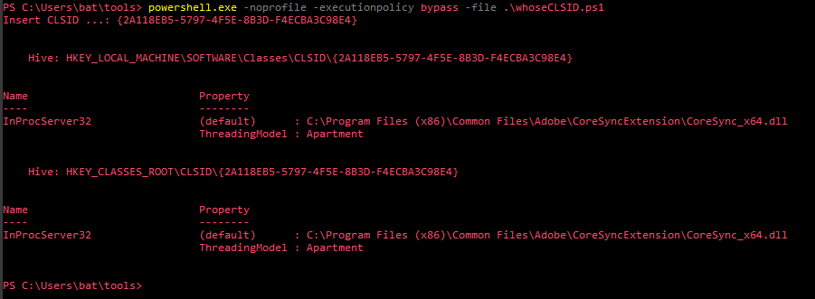

# whoseCLSID

A simple script intended to receive a CLSID input and output the correlated process name according to the local registry.

This was created entirely to circumvent my laziness.

# Usage
`powershell.exe -noprofile -executionpolicy bypass -file .\whoseCLSID.ps1`

