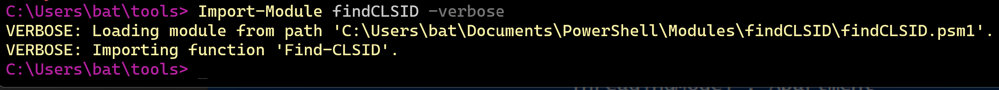

# whoseCLSID

A simple script intended to receive a CLSID input and output the correlated process name according to the local registry.

This was created entirely to circumvent my laziness. If you are also lazy, check `Add as a Module`, `.psm1` file is also included.

# Usage
`powershell.exe -noprofile -executionpolicy bypass -file .\whoseCLSID.ps1`

# Add as a Module
First, define the correct directory by checking the local environment variables:
`$env:PSModulePath -split ';'`

In my case, I chose my local user's modules directory but putting it in `system32\WindowsPowerShell\` should make it available to all users*.

Move the directory `whoseCLSID` with its single `whoseCLSID.psm1` file to the chosen directory. After moving it, run `Import-Module whoseCLSID -verbose`. If no errors return, run `Find-CLSID` in a stand-alone window:

If errors return for execution policy issues, run `Get-ExecutionPolicy -List`:

Reference [Microsoft docs](https://docs.microsoft.com/en-us/powershell/module/microsoft.powershell.core/about/about_execution_policies?view=powershell-7.2) for a policy setting that works for you. Otherwise, run through the above steps with `powershell.exe -executionpolicy bypass -file <file>` so the bypass is per command so global settings remain untouched. As the cmdlet is not signed, it cannot execute under `undefined` or `restricted` policies.

> *Don't quote me on that, I may be wrong